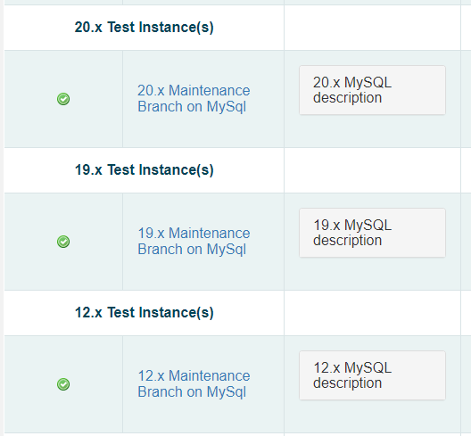

Quality Assurance

Team

Onboarding Manual

Quality Assurance mission is primarily to uncover and report software bugs, to verify fixes to software bugs, and to test for regressions.

[Getting Started with Sakai Quality Assurance (QA)](#_y45ggbv4p04)  

[Leadership and Logistics](#_3ot8chokpau9)

[Sakai QA Web Groups](#_c0nxl8vul8x9) 

[Sakai QA Weekly Meetings](#_p1qrad3vfvdk) 

[General QA Testing Overview](#_lyy2flgxt8s2)

[JIRAs Overview](#_qr0nx6xus4az) 

[Creating a JIRA](#_j8tkm53e3op7)

[Tips to Stay Organized](#_pru0riqmyb5) 

[Verifying Jiras on trunk (master)](#_fbs8ku31t4k3) 

[Test Plan Passes](#_8i02cbgoqr68) 

[Test Plan Fails](#_wmkhupn7zrwh) 

[Verifying Jiras on other branches (servers)](#_vuj4aspqc0s) 

[Test Plan Passes](#_jjrqmg24trtu) 

[Determine Server For Testing](#_bctgwlp9abcd) 

[Test Plan Fails](#_j7tpwpfagr78)

[Incorporated Jiras](#_q5c8nw5ehlmt)

[General Testing Steps](#_kx46w6hm3kdw)

[Conclusion](#_4u7k99ahfk2w)

# **Getting Started with Sakai Quality Assurance (QA)**

Welcome to Sakai Quality Assurance! Our goal is threefold:

- uncover and report software bugs, 
- to verify fixes to software bugs, 
- to test for regressions. 

Thank you for volunteering to make Sakai better through QA testing. Let’s get started!  
# **Leadership and Logistics**

**Current QA Chair:**  

\- Mark Golbeck from Learning Experiences (email: <mark.golbeck@learnxp.com>)

**Current QA Co-Chair:** 

\- Andrea Schmidt  (email: <andrea.g.schmidt@gmail.com> )
## **Sakai QA Web Groups**

You will want to join two emailing groups, which we use regularly: 

- The first is the developer group. This group mostly gets emails about technical problems. Join by following this link: <sakai-dev@apereo.org>. 
- The other group to join is Sakai QA Testing. Join by following this link: <sakai-qa@apereo.org>.  Everything you need to know, any question you want to ask - is fair game.. 

For real time texting, etc, you’ll want to join the Apereo slack channel (apereo.slack.com). If you don't already have a slack account you will want to make one. Slack website url is as follows <https://slack.com/> . Create an account and sign in. On the screen asking you to sign in to your workspace, type “apereo” and click continue. If any questions arise, contact the current chair of Sakai QA.  

The Apereo Slack workspace contains the following useful channels: #general, #sakaigeneral, #sakaidevs, and #sakaiqa. You can also send direct messages to the QA Team members. 
## **Sakai QA Weekly Meetings**

We stay focused as a group with 2 web conferences a week, an hour each. 

The first meeting we regroup from the week before and plan out the work for the coming week. 

QA Planning

######For more info on meetings, please contact(email) Mark Golbeck.

# **General QA Testing Overview**

Report your findings in concise, clear, unambiguous language. Short article: [Kiss method for bug reporting.](https://testlio.com/blog/kiss-method-for-bug-reporting/). Make and keep your commitment(s) to test by signing up [on this spreadsheet.](https://docs.google.com/spreadsheets/d/1xf0gQ6zvsh76ScMkeK4AsQqmGZr9tO6xPjzyE4-SviU/edit#gid=1) We want to cover all features, all tools, in Sakai. This is how we know whether we’ve done that or not.

The spreadsheet (updated often) lists the tools within Sakai which need testing. They are rated by priority ranging from low to high. 

When a brand new version of Sakai becomes available for QA on community servers ([listed here](https://nightly2.sakaiproject.org)) we run regression scripts throughout all the tools. By **scripts** we are normally not referring to an automated testing suite of **scripts** , although we have some of those.  Instead, we are normally referring to steps written out by functional experts who know how the software is supposed to behave, and followed by human testers. Us.

After regression testing throughout Sakai has been run through once, we move on to test the **medium priority tools**. At this point we aren’t looking for things which “regressed”, that is, things that worked in the previous version but now are broken. Now we are concerned that all basic functionality in each tool works “as advertised”.  We call this testing **smoke testing**. It’s a basic run-through at a not too detailed level, not the edge cases or large class sizes or that thing that one professor does, but testing that exercises a large portion of the workflow of the item being tested.

The **high priority tools** get tested again after changes resulting from our regression testing are made by developers. At this point we’ll determine in the QA Planning calls how rigorous that testing will be and to what extent we want to exercise those **edge cases**. This depends on how many changes have been made after regression testing the first time around. 

Although not everyone doing QA will be writing testing scripts for the rest of us to use, this article on [how to write test cases](https://www.softwaretestinghelp.com/how-to-write-effective-test-cases-test-cases-procedures-and-definitions/) will help us all become better testers.  

Jointly with the Dev Team, the QA Team helps determine our readiness for the new version first release candidate (RC01). The testing scripts will be in a column called **Sakai [version#] Testing Script**. In the spreadsheet [referred to above for Sakai 19](https://docs.google.com/spreadsheets/d/1xf0gQ6zvsh76ScMkeK4AsQqmGZr9tO6xPjzyE4-SviU/edit#gid=1) the [version#] would be **19**. What happens when you’re following a test script and something unexpected happens, or breaks? You create a **bug report**; we call them **Jiras**. 
## **JIRAs Overview**
- The following page has everything you need to know about creating Jiras : [https:/confluence.sakaiproject.org/display/MGT/Sakai+Jira+Guidelines](https://confluence.sakaiproject.org/display/MGT/Sakai+Jira+Guidelines) . 
- But first you need an account to login (if you don’t login you can’t create or edit Jiras). Email <sakaicoordinator@apereo.org> for your own Jira account. 
- Time for a little training: [How to create a Jira (1:49)](https://www.screencast.com/t/EhrDBbUocWuR).
- And eventually a lot of training (highly recommended) : [On the Job QA Testing Skills (58:11)](https://343772.kaf.kaltura.com/embed/secure/iframe/entryId/1_vsuzhcxa/uiConfId/42921001/pbc/109311981)

## **Creating a JIRA**
Wrapping it up:

- As QA testers we review issues (**bug reports** or “**Jiras**”) that developers have “resolved” (or “fixed”) and we change their status to “Verified” if they pass our testing. We do this by clicking the button near the top of the issue which says, “Tested.” Sometimes an issue doesn’t pass our testing the first time, so we write a comment on the issue describing our testing process and the actual results. The assigned developer gets an email and goes back to work on it.
- As QA testers we often find **new bugs**, and if so, we write a new **bug report**, a **Jira**.
## **Tips to Stay Organized**
When verifying a JIRA you will want to test on the main trunk for Sakai found at the following link: <https://trunk-mysql.nightly.sakaiproject.org/portal/> . 

Often you need to test on another server to discover on which version the feature broke. This link lists all servers for the different versions of Sakai: <http://nightly2.sakaiproject.org/> . 

You will be sent a list (a public filter) QA Chair of Jiras to test. An example of a filter for Sakai 19 is as follows: <https://jira.sakaiproject.org/issues/?filter=16780> . This filter was created by Earle Nietzel, and named [**19 Ready To QA**](https://jira.sakaiproject.org/issues/?filter=16780). 

You can create your own filters after logging in to <https://jira.sakaiproject.org/secure/Dashboard.jspa>,  click **Create Filter**. 

The above 19 Ready To QA filter was created with the following keywords in the search box: 

**project = Sakai AND status = Resolved AND resolution = Fixed AND "19 status" = "Please Merge" ORDER BY resolutiondate ASC**

To bookmark for later, click **Save as** next to the filter name, and give the copy the name of your choice.

Looking through the JIRA list, make sure the status is **Resolved**. Click on one of the JIRAs. If the label *does not* say **qadevneeded** then it needs QA attention. Please assign it to yourself and begin working on it**.** If it does have the label **qadevneeded ,** skip it because a developer will need to look at it. 

Where it says People as the header and Assignee: you will want to click on the Assign to me button to assign the JIRA to yourself. Next you will notice two tabs that say General and Testing. First click on the General Tab if it is not already selected. Read over the description of the JIRA. Look at any attached screenshots. Look at any comments in the activity portion of the JIRA. Next you will want to click on the Testing tab found to the right of the General tab. Here you should find a test plan to follow. If you follow the test plan and the desired results are not met, you go back to the JIRA and click on Reopen at the top of the page. When you click on Reopen it will send the JIRA back to the Reporter so they can look at it again. You may also want to comment in the JIRA your findings after following the test plan. The comment should include the server tested on and the outcome of testing.  Now if you go through the test plans steps and the desired results are met then you back to the JIRA and click Tested at the top of the JIRAs page. Once the JIRA has been tested it will be merged. 
# **Verifying Jiras on trunk (master)**
Keep in mind that once something has been set to "resolved", it will not be on the server until after the restart. The server list has the restart times at the bottom: <http://nightly2.sakaiproject.org/>

Most Jiras are verified on [Trunk (master) on MySql](https://trunk-mysql.nightly.sakaiproject.org/portal/), but sometimes a Jira indicates it needs to be tested for Oracle or on Experimental:

## **Test Plan Passes**

If the test plan passes and the Jira has been verified, and it is merged, the 20 (or 19) status will change from "Please merge" to "Resolved".

When you verify the test plan has passed, include the server, (example for trunk/master: <https://trunk-mysql.nightly.sakaiproject.org/> , this can be found in the address bar of the version you are testing) and the  build info (see image ) in your comment.

Once that happens, this Jira needs to be tested on 20x (or 19x, depending which shows as resolved), and if that works correctly, then you would set the 20/19 status to "Verified".

## **Test Plan Fails**

If the test plan fails, and the Jira has not been closed or merged to another branch, click “Reopen” and add details of the failure to your comment.

Also include the server, (example for trunk/master: https://trunk-mysql.nightly.sakaiproject.org/) and the  build info in your comment.

# **Verifying Jiras on other branches (servers)**
## **Test Plan Passes**

If a Jira displays as verified or closed for trunk (master), and has been merged to another branch, the status for that server will show as resolved.

Follow the test plan on the appropriate server, and if it passes, set the “Resolved” status to “Verified”.

When you verify the test plan has passed, include the server and the  build info in your comment.

## **Determine Server For Testing**
The servers are listed on <http://nightly2.sakaiproject.org/>

Merged Jiras should be verified on the “x” version of the server. 

## **Test Plan Fails**
After a Jira has been closed and merged to another branch, do not re-open the Jira.

Add a comment to the Jira indicating what failed along with the server and build information in the comment. 

Open a new Jira and link it to the existing Jira. You cannot “link” the old Jira until after you have saved your new Jira. In your new Jira, click on the “More” button, scroll down and click Link. You will need to enter the SAK-XXXXX information for the old Jira.

# **Incorporated Jiras**

If a Jira has been set to “Resolved” and the resolution is shown as “Incorporated”, check the Jira that actually has the fix. If the test plan is different in that Jira, add the test plan from the “incorporated” Jira to the Jira that actually has the fix to make sure all cases are tested.
# **General Testing Steps**
For general testing you will be given a spreadsheet as mentioned above in General QA Testing Overview that will have the link to the server you will use for testing.  

Steps for going through the QA Spreadsheet:

1. Click on the link given in the spreadsheet. This will lead you to the home page for Sakai. 
1. You will want to type in admin for the username and for the password. This will make you a Sakai Administrator on this server. 

Next you will want to create some users for testing purposes. You will need at the very minimum two students, one TA, and one instructor. (Note: the Become User tool should not be used, as some bugs may be present in that tool rather than the one being actively tested)

How to create a User:

1. With the Home tab selected, you will want to find the Users menu option under the Overview menu. 
1. Click the Users menu option. 
1. Next you will want to click the New User button.  
1. For the password you can choose what you want. 
1. For the instructor role and TA role you will want the type to be maintain.
1. Next you will click Save Details. This will bring you back to the Users page which shows all the current users. The user you just created should appear at the top of the list. If not you can type the user ID in the search box above and click Search. When you create the student user accounts the only thing that is different is that the type will be registered. 

Now that you have a set of user accounts for testing you will need to create a site and add them to the active roster. With the Home tab selected still, you will want to look under the Overview menu options for the menu option Worksite Setup. Click on the Worksite Setup menu option. Click on the Create New Site button to create a new site. Build your own site radio button will already be selected. Click on the Build your own site radio button and two options are in a sub menu. You will want to click on the course site radio button. Choose any term that you prefer. Next click the Continue button at the bottom of the page. Select any of the courses shown by checking the far left box next to the course name. Scroll down to the bottom of the next page and click Continue. The next page is for site tools. Depending on the site tools you are testing in the test script you will want to select them here. At the bottom of the page click Continue. Again go to the bottom of the page and click Continue. This will bring you to the final page where you will want to click the Create Site button found at the bottom of the page. A message at the top of the screen will appear saying your course site has been added click on the hyperlink for your course. Now your course site has been created.  

Next we will need to add users to the course site. 

The following are steps to add users to the course site:

1. While still being in the new course site you will want to look on the left hand side under the Overview menu option for a Site Info sub menu option. 
1. Click on the Site Info sub menu option. 
1. One of the options in Site Info menu option is Add Participants. 
1. Click on Add Participants. You will want to add each of the user accounts individually. 

The process is the same for each role but different on the role page. 

For example, adding the instructor to the course. Under the Other Official Participants in the Official Email Address or Username type in the instructor user ID. In the above example we used learning\_exp\_instr\_1. Next you will click the Continue button at the bottom of the page. The next page is where you choose the role for the user. Since we are adding the instructor we would check the radio button next to the Instructor role. Then we click on the Continue button at the bottom of the page. On the following page click Continue again. On the final page click Finish button to add the user to the course. You will want to repeat this process for the TA and the student user accounts. 

In terms of testing, every Monday the servers will be refreshed and all previous work will be erased. Make sure you plan for this while you are testing. If you need to have your work not erased you will need to talk to a developer. A developer should be able to assist you with. If they cannot contact the current QA team lead. 
# **Conclusion**
Now you are ready to test JIRAs and do general testing. The above procedure steps were for Sakai 19 as of 4/29/2019. These steps may change over the course of time as will this document. Welcome to the QA Team  and thank you for your future efforts in making Sakai better!

