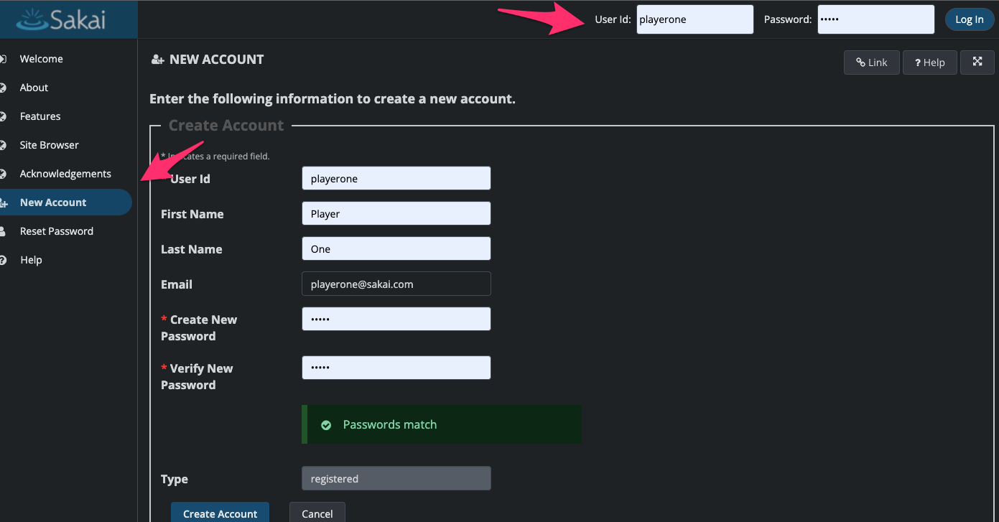
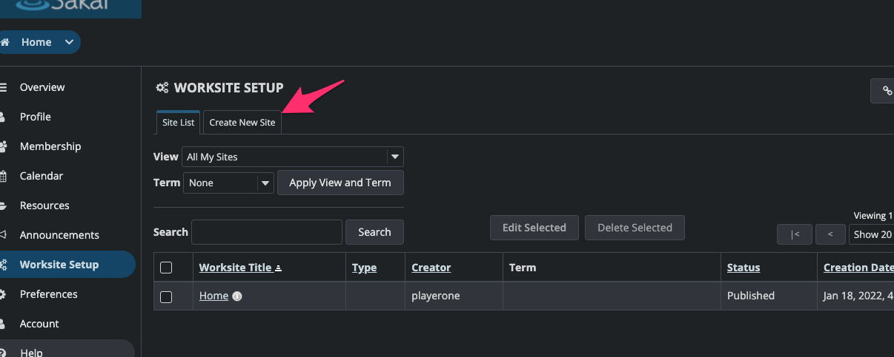
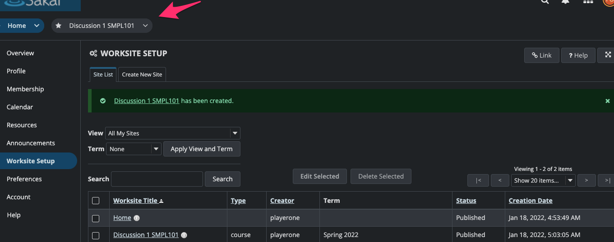

# How to Create a Course Sites

###### You will need an account to create a course site.
  - You can create an account or you can use an existing account on `Sakai Portal`.

   

###### After signing in, you will be taken to the home page.
 - Click on `Worksite Setup`

   

 - Fill out the `Required Fields`

 - Select the `Sakai Tools` you want to use.

 - And voila, you have a course site!

   

   *If you any questions, Please reach @kunaljaykam(Gmail/Twitter)*