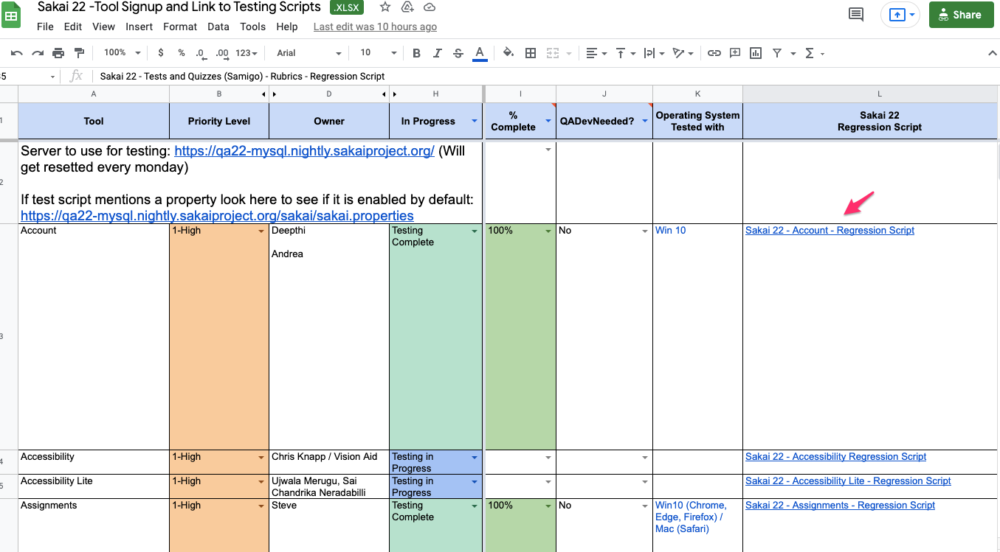
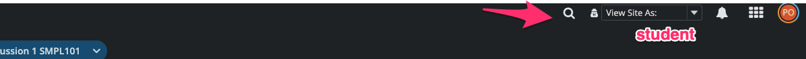

## _Quick Start Guide For Sakai QA_

##### Get started with Sakai QA 
As of `18-01-2022`, we are testing Sakai 22 using the regression scripts found in the Sakai 22 Tool sign-up spreadsheet. The link to the spreadsheet can be found here: 
[Sakai-22 Regression Script Testing](https://bit.ly/Sakai_22_Regression_Script_Testing)

In the spreadsheet, you find everything you need to start testing.

> [!NOTE]
Unless otherwise stated, all testing is taking place on the Sakai 22 server (refreshed weekly on Mondays).
   
   When testing notifications/email, you can check the Mail Catcher server to confirm sent messages - https://mail.nightly.sakaiproject.org/

#### How to run the regression tests:
- Make sure to take a look at Sakai Portal's [How to Create a Course Sites](how-to-create-a-course-sites.md)
- Pick the tool you want to test. 
 >  Before you start testing, check the regression script for that tool. Go through each tabs to understand what you need to do.
- Now put your name and other information in the spreadsheet. Take a deep breath and start testing :)

##### *Bonus Tip*
> *You can test as a student by just changing the view to "Student" in your course site* 
 

##### If test fails, you can create a jira
 - [How to create a Jira](how-to-create-a-jira.md)

##### Please check out the [Sakai QA Wiki](https://sakai-wiki.github.io/Sakai-QA-Home-Page) for more information on Sakai QA Onboarding process.

   *If you any questions, Please reach @kunaljaykam(Gmail/Twitter)*